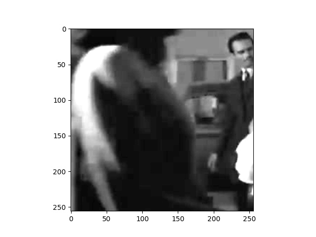
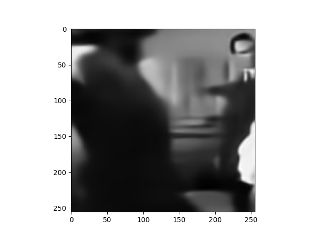

# Decoding dynamic visual scenes across the brain hierarchy
This is the code and data of **Decoding dynamic visual scenes across the brain hierarchy**

## Preparation
Download the training data example from [Google Drive](https://drive.google.com/drive/folders/1SAaq6XAOt6bayl_9PdR7vdASDFMliyYN?usp=drive_link)

Download the decoding results example from [Google Drive](https://drive.google.com/drive/folders/1s0Vel6n6PJmwbdu53JFcM1JWO6zOxWce?usp=drive_link)

## Requirements
See [Requirements](requirements.txt)

## Training 
run
`python train.py`
The training result will be stored in ./paper_results and ./model_weights

## Test
run
`python test.py`
This will calculate SSIM and PSNR of the results and the decoding figures will be stored in ./figs
 

## License
Available under the GPL v3 license. 
